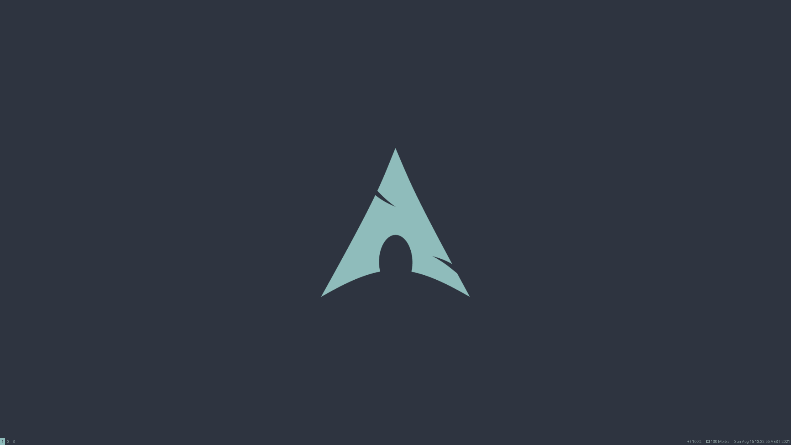
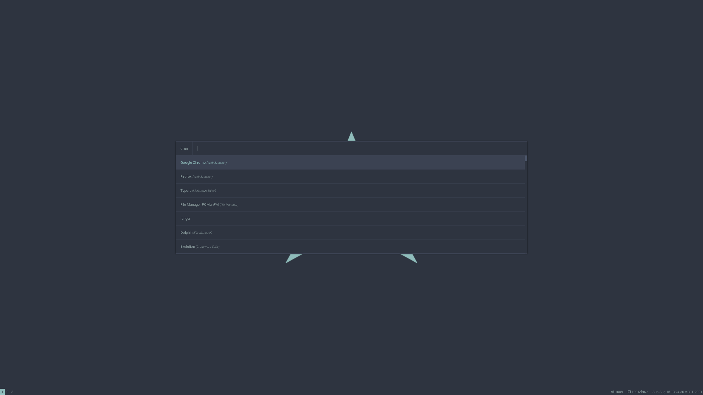

# i3 tiling window manager

## My i3
My primary driver is **Arch Linux** with **i3** on my desktop.

i3 is the only desktop (wm) that does not get in the way. Using other tiling window mangers was not intuitive for me, but using i3, well... it just clicked!

My **i3** setup uses a Nordic theme, with a clean and minimalistic look and feel.

The applications I use were chosen primarily from the Gnome and KDE desktop environments. My development machines have sufficent memory (PC:16GB RAM, laptop:32GB RAM) therefore I do not feel the need to go 'light'. I have chosen in my opinion the 'best' apps that can get the job done - don't judge bro ;)
 
 
## About
This repo was created primarily as a backup of my installation guide and configuration files. Also by sharing this I hope to give back to the i3 community - helping others with their setups and configurations.
 
 
## Screenshots
A couple of sample screenshots...
 

 
 

 
 
To view more go to the /[screenshot](screenshot) folder.
 
 
## Components

| Program | Name |
| ------- | ---- |
| WM | i3-gaps |
| Launcher | rofi |
| Background | feh |
| Notification | dunst |

